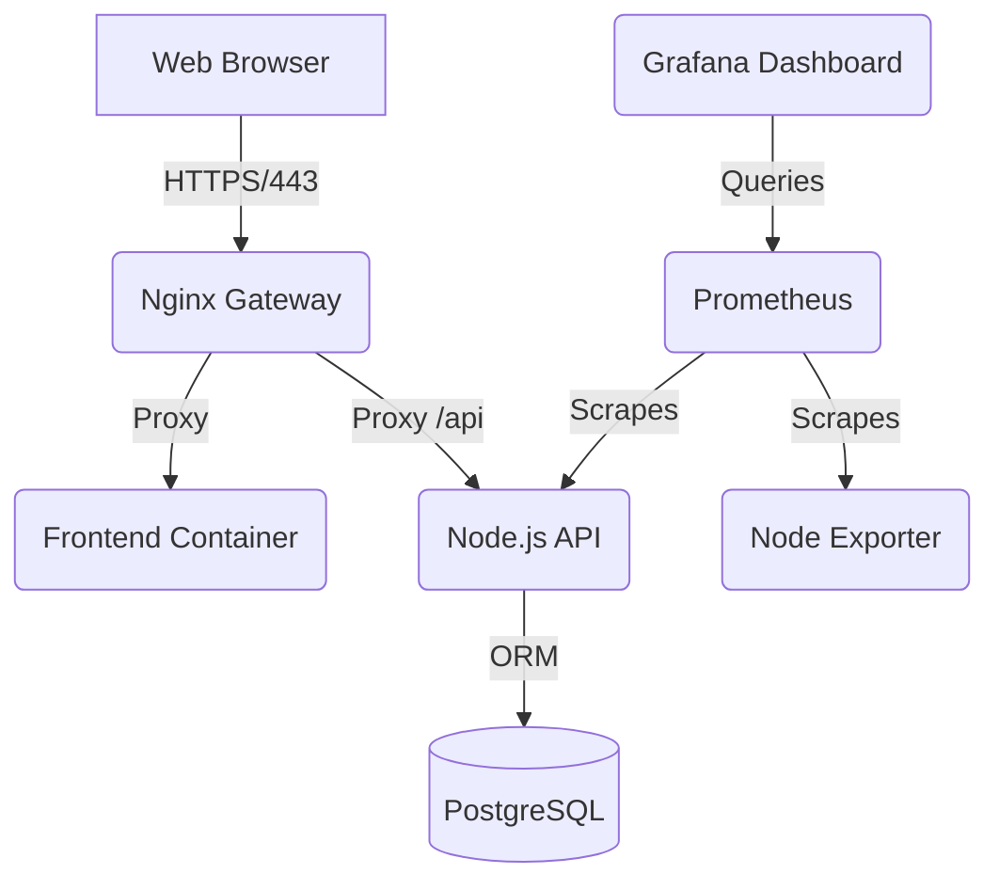

# La Bella Cucina 🍝

> **A Premium Italian Dining Experience** – A full-stack restaurant management ecosystem featuring real-time ordering, intelligent reservations, and a robust administrative control center.

### 🌐 [Live Demo: https://labella.inovoid.me](https://labella.inovoid.me)

---

## 🚀 Vision
La Bella Cucina isn't just a website; it's a production-ready solution for modern dining. From a high-performance customer front-end to a DevOps-monitored infrastructure, every component is designed for scale, security, and professional management.

---

## 📽️ Visual Showcase

<div align="center">
  <table>
    <tr>
      <td width="50%">
        <strong>Home Experience</strong><br>
        <!-- Add screenshot: frontend/home page -->
        
      </td>
      <td width="50%">
        <strong>Dynamic Menu</strong><br>
        <!-- Add screenshot: frontend/menu page -->
        
      </td>
    </tr>
    <tr>
      <td>
        <strong>Online Ordering</strong><br>
        <!-- Add screenshot: frontend/order page -->
        
      </td>
      <td>
        <strong>Smart Reservations</strong><br>
        <!-- Add screenshot: frontend/reservations page -->
        
      </td>
    </tr>
  </table>
</div>

---

## ✨ Core Pillars

### 🍽️ Seamless Customer Journey
- **Dynamic Menu Explorer**: Browse high-resolution dish galleries categorized for easy discovery.
- **Integrated Shopping Cart**: Intuitive cart management with quantity controls and instant feedback.
- **Secure Checkout**: Payments processed via a robust **PayHere** integration.
- **Automated Reservations**: Real-time table booking with instant status tracking.

### 🛡️ Enterprise Admin Control
- **Unified Dashboard**: Live metrics for revenue, order volume, and active reservations.
- **Inventory & Menu Control**: Full CRUD operations for menu items with secure image uploads.
- **Order Lifecycle Management**: Transition orders from *Pending* to *Delivered* with one click.
- **Staff Governance**: Manage team access levels (Admin, Staff, Customer).

### 📈 DevOps & Observability
- **Prometheus & Grafana**: Professional-grade monitoring stack for real-time system health.
- **PostgreSQL Power**: Relational data integrity via Sequelize ORM.
- **Dockerized Ecosystem**: 9 isolated microservices working in perfect harmony.
- **SSL Security**: Automated certificate management via Certbot for secure production traffic.

---

## 🛠️ Technical Architecture



---

## 💻 Tech Stack

### Frontend & UI
- **Structure**: Semantic HTML5, CSS3 Variables
- **Logic**: Vanilla JavaScript (ES6+), Fetch API
- **Icons**: FontAwesome 6 Pro

### Backend & Data
- **Engine**: Node.js & Express.js
- **Database**: PostgreSQL 16
- **ORM**: Sequelize
- **Security**: JWT (JSON Web Tokens), bcrypt

### Infrastructure & DevOps
- **Gatekeeper**: Nginx (Reverse Proxy, SSL Termination)
- **Containerization**: Docker & Docker Compose
- **Monitoring**: Prometheus, Grafana, cAdvisor, Node Exporter
- **Payment Gateway**: PayHere

---

## 🚦 Getting Started

### 📋 Prerequisites
- **Docker Desktop** installed on your local machine.
- A **PayHere** merchant account (sandbox or live).

### 🚀 Quick Start (Local)
1. **Clone & Enter**:
   ```bash
   git clone <your-repo-url>
   cd Restuarant
   ```
2. **Environment**:
   ```bash
   cp backend/.env.example backend/.env
   # Edit backend/.env with your local secrets
   ```
3. **Launch**:
   ```bash
   docker-compose up -d --build
   ```
4. **Seed**:
   ```bash
   docker exec -it labella_backend_prod node scripts/seed-admin.js
   ```

### 🌍 Production Deployment
For deploying to AWS EC2 with SSL and Monitoring, refer to our dedicated guide:
👉 **[DEPLOY.md](DEPLOY.md)**

---

## 📈 Monitoring & Health
Your system health is visualised in real-time at `/grafana/`.
- **Primary Dashboard**: La Bella Cucina Service Overview
- **Key Metrics**: CPU, Memory, Container Health, and Database Connectivity.

---

## 📄 License
This project is an academic assignment intended for educational and portfolio demonstration purposes.

---
<div align="center">
  Made with ❤️ for La Bella Cucina
</div>
